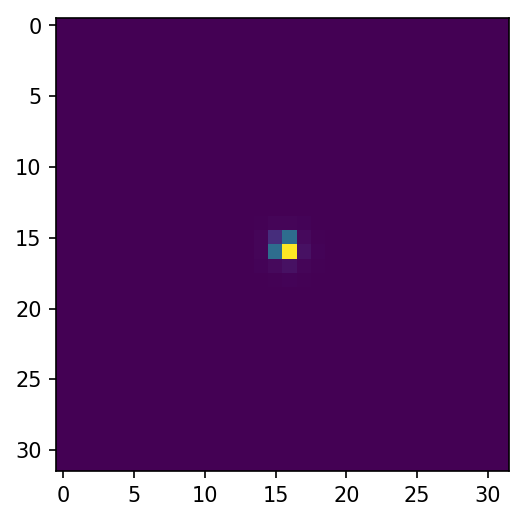

Performing Radiometrically Correct Propagations
===============================================

We'll define a simple pupil, detector, and source object that returns at-aperture
irradiance in terms of photons/s/m^2. Note we must normalize the amplitude array
using :func:`~lentil.util.normalize_power` to ensure the source flux is preserved
through the diffraction propagation.

.. code:: pycon

    >>> import numpy as np
    >>> import matplotlib.pyplot as plt
    >>> import lentil
    >>> amp = lentil.util.circle((256, 256), 128)
    >>> amp = lentil.util.normalize_power(amp)
    >>> pupil = lentil.Pupil(diameter=1, focal_length=10, pixelscale=1/256, amplitude=amp)
    >>> detector = lentil.Detector(pixelscale=5e-6, shape=(1024,1024))
    >>> source = lentil.radiometry.Spectrum(wave=np.arange(350,701),
    ...                                     value=1e4*np.ones(351),
    ...                                     waveunit='nm', valueunit='photlam')

Now we can call propagate. Note we must provide wavelength in terms of meters and
multiply the source irradiance by the collecting area to get photons/second.

.. code:: pycon

    >>> psf = lentil.propagate([pupil, detector],
    ...                        wave=source.wave*1e-9,
    ...                        trans=source.value*(np.pi*(pupil.diameter/2)**2),
    ...                        npix=32)
    >>> print('Source flux: ', np.floor(np.sum(psf)), 'photons/second')
    Source flux: 2730045.0 photons/second

    >>> plt.imshow(psf)

We can increase the performance of the propagation by pre-binning the source flux. This
preserves the integrated power of the source, but will wash out any fine features
present in the source's spectral response.

.. code:: pycon

    >>> binned_wave = np.arange(350, 701, 50)
    >>> binned_flux = source.bin(binned_wave, valueunit=source.valueunit)
    >>> psf = lentil.propagate([pupil, detector],
    ...                        wave=binned_wave*1e-9,
    ...                        trans=binned_flux*(np.pi*(pupil.diameter/2)**2),
    ...                        npix=32)
    >>> print('Source flux: ', np.floor(np.sum(psf)), 'photons/second')
    Source flux: 2722236.0 photons/second

    >>> plt.imshow(psf)

The resulting images and total flux are very nearly the same, but the binned propagation
runs 50 times faster.

.. code:: python3

    import numpy as np
    import lentil

    class Model:

        # We assume we have already defined a pupil, detector, and source object and
        # that the source object returns at-aperture irradiance
        pupil = Pupil()
        detector = Detector()
        source = Source()

        planes = [pupil, detector]

        def propagate(self, npix=None, oversample=2, rebin=True, tilt='phase',
                      npix_chip=None, wave_sampling=25e-9, flux_trim_tol=1e-2):

            bandpass = self.pupil.transmission
            bandpass.trim(flux_trim_tol)

            if wave_sampling:
                start = bandpass.wave[0]
                stop = bandpass.wave[-1]
                num = int(np.round((stop-start)/wave_sampling*1e9)))
                wave = np.linspace(start, stop, num)
                trans = bandpass.sample(wave)
            else:
                wave = bandpass.wave
                trans = bandpass.value

            return lentil.propagate(self.planes, wave*1e-9, trans, npix, npix_chip,
                                    oversample, rebin, tilt, flatten=True)

If we would like to render an image as read out by the detector, we add light_flux and
image methods to the Model class:

.. code:: python3

    import numpy as np
    import lentil

    class Model:

        ...

        def light_flux, self, qe=1):
            flux.to('photlam')
            flux *= self.pupil.transmission
            flux *= qe  # flux is now in e-/s
            return flux

        def image(self, ts, npix=None, window=None, nframes=1, oversample=2,
                  tilt='phase', npix_chip=None, pixelate=True, warn_saturate=False,
                  wave_sampling=25e-9, flux_trim_tol=1e-2):

            flux = self.light_flux(self.source, qe=self.detector.qe)
            flux.trim(flux_trim_tol)

            if wave_sampling:
                start = flux.wave[0]
                stop = flux.wave[-1]
                num = int(np.round((stop-start)/(wave_sampling*1e9)))
                wave = np.linspace(start, stop, num)
            else:
                wave = flux.wave

            binned_flux = flux.bin(wave, waveunit=flux.waveunit)

            # do the propagation
            img = lentil.propagate(self.planes,
                                   wave=wave * 1e-9,
                                   weight=binned_flux,
                                   npix=npix,
                                   oversample=oversample,
                                   rebin=False,
                                   tilt=tilt,
                                   npix_chip=npix_chip,
                                   flatten=True)

            frame = np.empty((nframes, img.shape[0]//oversample, img.shape[1]//oversample))

            for f in np.arange(nframes):
                frame[f] = self.detector.frame(flux=img,
                                            ts=ts,
                                            wave=None,
                                            waveunit=None,
                                            oversample=oversample,
                                            pixelate=pixelate,
                                            collect_charge=False,
                                            window=window,
                                            warn_saturate=warn_saturate)

            if nframes == 1:
                frame = frame[0, :, :]

            return frame
