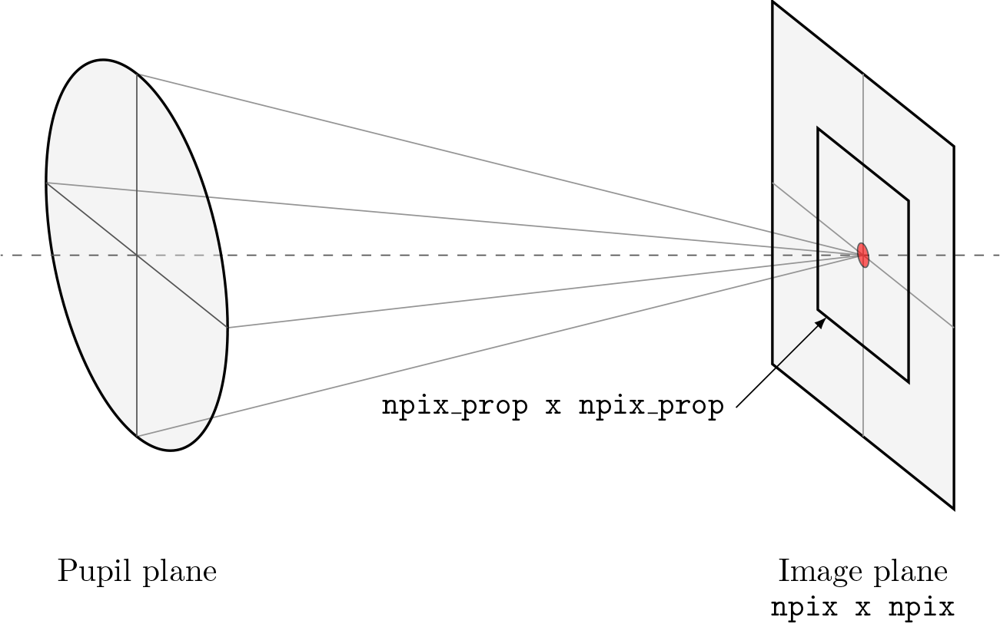

.. _user.diffraction:

*********************************
Numerical diffraction propagation
*********************************

Lentil uses Fourier transform-based algorithms to numerically model the 
propagation of an electromagnetic field through an optical system. The 
electromagnetic field is represented by a |Wavefront| object which stores the 
complex amplitude of the field at a discretely sampled grid of points. The 
optical system is represented by a set of |Plane| objects which the wavefront 
interacts with as it propagates through the system.

.. note::

    This section of the User Guide assumes some understanding of physical and
    Fourier optics. In-depth mathematical background and an extensive 
    discussion of the validity of each diffraction approximation is available 
    in [1]_.

Numerical diffraction propagation
=================================
Lentil numerically models diffraction by propagating a |Wavefront| object 
through any number of |Plane| objects representing an optical system. This 
propagation always follows the same basic flow:

Create a new wavefront
----------------------
A |Wavefront| represents a monochromatic, discretely sampled complex field 
that may propagate through space. By default, when a new |Wavefront| is 
constructed it represents an infinite plane wave (complex field = ``1+0j``).
Note that "infinite" in this case really just means that the wavefront field
is `broadcastable 
<https://numpy.org/doc/stable/user/basics.broadcasting.html>`_ to any shape 
necessary.

.. code-block:: pycon

    >>> w1 = lentil.Wavefront(wavelength=650e-9)
    >>> w1.field
    1+0j
    >>> w1.focal_length
    inf

Propagate the wavefront through a plane
---------------------------------------
The planes that describe an optical system typically modify a propagating
wavefront in some way. By multiplying a |Wavefront| and a |Plane| together, a 
new |Wavefront| is returned representing the the complex field after 
propagating through the plane:

.. code-block:: pycon

    >>> pupil = lentil.Pupil(amplitude=lentil.circle((256, 256), 120),
    ...                      pixelscale=1/240, focal_length=10)
    >>> w2 = w1 * pupil

Note the complex field of ``w2`` now clearly shows the effect of propagating through the
circular aperture of ``pupil``:

.. code-block:: pycon

    >>> plt.imshow(np.abs(w2.field))

.. plot::
    :context: reset
    :scale: 50

    pupil = lentil.Pupil(amplitude=lentil.circle((256, 256), 120),
                         pixelscale=1/240, focal_length=10)
    w1 = lentil.Wavefront(650e-9)
    w2 = w1 * pupil
    plt.imshow(np.abs(w2.field), cmap='gray')

Additionally, because ``w2`` was propagated through a |Pupil| plane, it has inherited the
pupil's focal length:

.. code-block:: pycon

    >>> w2.focal_length
    10

.. note::

    Additional details on the plane-wavefront interaction can be found in
    :ref:`user.wavefront.plane_wavefront`.

Propagate the wavefront to the next plane
-----------------------------------------
The table below describes what propagation method (or general transformation) 
should be performed based on the wavefront and plane ``ptype``:

=================== =============== ==============================================================
Wavefront ``ptype`` Plane ``ptype`` Method
=================== =============== ==============================================================
``pupil``           ``image``       :func:`~lentil.propagate_dft` or :func:`~lentil.propagate_fft`
``image``           ``pupil``       :func:`~lentil.propagate_dft` or :func:`~lentil.propagate_fft`
``pupil``           ``pupil``       Flip, resample, or none
``image``           ``image``       Flip, resample, or none
``none``            ``none``        Far field propagation not supported
=================== =============== ==============================================================

.. note::

    When propagating between like planes (pupil to pupil or image to image),
    no additional diffraction propagation step is required.

Numerical diffraction propagations are defined by the following attributes:

* :attr:`pixelscale` - the spatial sampling of the output plane
* :attr:`shape` - the shape of the output plane
* :attr:`prop_shape` - the shape of the propagation plane. See
  :ref:`user.diffraction.shape` for additional details.
* :attr:`oversample` - the number of times to oversample the output plane.
  See the section on :ref:`sampling considerations 
  <user.diffraction.sampling>` for more details.

For example, to propagate a |Wavefront| from a |Pupil| to an |Image| plane:

.. plot::
    :context: close-figs
    :include-source:
    :scale: 50

    >>> w2 = lentil.propagate_dft(w2, pixelscale=5e-6, shape=(64,64), oversample=5)
    >>> plt.imshow(w2.intensity, norm='log', cmap='inferno', vmin=1e-4)

Propagate through remainder of model
------------------------------------
If multiple planes are required to model the desired optical system, the steps
described above should be repeated until the |Wavefront| has been propagated 
through all of the planes.

.. _user.diffraction.broadband:

Broadband (multi-wavelength) propagations
=========================================
The steps outlined above propagate a single monochromatic |Wavefront| through an
optical system. The example below performs the same operation for multiple
different wavelengths and accumulates the resulting image plane intensity:

.. plot::
    :context: reset
    :scale: 50
    :include-source:

    pupil = lentil.Pupil(amplitude=lentil.circle((256, 256), 120),
                         pixelscale=1/240, focal_length=10)

    wavelengths = np.arange(450, 650, 10)*1e-9
    img = np.zeros((320,320))

    for wl in wavelengths:
        w = lentil.Wavefront(wl)
        w = w * pupil
        w = lentil.propagate_dft(w, pixelscale=5e-6, shape=(64,64), oversample=5)
        img += w.intensity

    plt.imshow(img, norm='log', cmap='inferno', vmin=1e-4)

Keep in mind the output ``img`` array must be sized to accommodate the oversampled
wavefront intensity given by ``shape`` * ``oversample``.

Increasing broadband propagation performance
--------------------------------------------

Using Wavefront.insert()
~~~~~~~~~~~~~~~~~~~~~~~~
Each time ``wavefront.field`` or ``wavefront.intensity`` is accessed, a new Numpy
array of zeros with shape = ``wavefront.shape`` is allocated. It is possible to
avoid repeatedly allocating large arrays of zeros when accumulating the result of
a broadband propagation by using :func:`Wavefront.insert` instead. This can result
in significant performance gains, particularly when ``wavefront.shape`` is large.

The above example can be rewritten to use :func:`Wavefront.insert` instead:

.. code-block:: python

    for wl in wavelengths:
        w = lentil.Wavefront(wl)
        w = w * pupil
        w = lentil.propagate_dft(w, pixelscale=5e-6, shape=(64,64), 
                                 oversample=5)
        img = w.insert(img)

Using Plane.freeze()
~~~~~~~~~~~~~~~~~~~~
Some planes implement custom :attr:`~lentil.Plane.opd` logic that computes the
return value each time the attribute (more accurately, property) is accessed. 
When using these planes in a broadband propagation performance will suffer 
since the :attr:`~lentil.Plane.opd` attribute is accessed for each wavelength.
Because the underlying OPD value is static for the duration of a propagation,
an opportunity exists to use a cached value which can provide a substantial
performance boost. :func:`Plane.freeze` provides this cache mechanism. Again
modifying the above example:

.. code-block:: python

    frozen_pupil = pupil.freeze()

    for wl in wavelengths:
        w = lentil.Wavefront(wl)
        w = w * frozen_pupil  # cached OPD value is used here
        w = lentil.propagate_dft(w, pixelscale=5e-6, shape=(64,64), oversample=5)
        img += w.intensity

.. _user.diffraction.sampling:

Sampling considerations
=======================
The accuracy of a numerical diffraction simulation depends on adequately 
sampling the input and output planes. The sections below describe how to 
select appropriate sampling for these planes and how to configure the
propagations to avoid the introduction of numerical artifacts.

Ensuring Nyquist-sampled output
-------------------------------
The relationship between spatial sampling in the input plane and output plane 
is defined by :math:`Q` and should be at least 2 in numerical simulations to 
ensure the output plane is Nyquist-sampled for intensity:

.. math::

    Q = \frac{\lambda \ F/\#}{du}

where :math:`lambda` is propagation wavelength, :math:`F/\#` is focal length 
divided by diameter, and :math:`du` is output plane spatial sampling. 
High-frequency ailiasing is clearly apparent in propagations where 
:math:`Q < 1.5` and still visibile to those with a keen eye when 
:math:`1.5 < Q < 2`:

.. plot:: user/plots/dft_discrete_Q_sweep.py
    :scale: 50

In cases where the optical system :math:`Q` is less than 2, the simulation 
fidelity should be increased by oversampling to avoid ailiasing. For a given 
imaging system, the system's :math:`F/\#`, output plane sampling, and 
propagation wavelength(s) will be fixed values. As a result, :math:`Q` can 
only be increased in a discrete propagation by introducing an ``oversample`` 
factor that effectively decreases the output plane sampling :math:`du`. In 
order to view the results of a propagation at native system sampling, the 
oversampled output plane must be resampled or rebinned.

.. math::

    Q_{\mbox{os}} = \frac{\lambda \ F/\# \ \texttt{oversample}}{du}

.. note::

    ``oversample`` should always be chosen to ensure :math:`Q > 2` for accurate
    propagation results.

Avoiding periodic wraparound
----------------------------

.. math::

    \texttt{npix}_{\mbox{DFT}} = \frac{1}{2 \ \alpha \ \ \texttt{oversample}}

.. plot:: user/plots/dft_q_sweep.py
    :scale: 50

.. _user.diffraction.shape:

``shape`` vs ``prop_shape``
===========================
Lentil's propagation methods have two arguments for controlling the shape of
the propagation output: ``shape`` and ``prop_shape``.

``shape`` specifies the shape of the entire output plane while ``prop_shape``
specifies the shape of the propagation result. If ``prop_shape`` is not
specified, it defaults to ``shape``. The propagation result is placed in the
appropriate location in the (potentially larger) output plane when a |Wavefront|
:attr:`~lentil.Wavefront.field` or :attr:`~lentil.Wavefront.intensity`
attribute is accessed.

It can be advantageous to specify ``prop_shape`` < ``shape`` for performance
reasons, although care must be taken to ensure needed data is not accidentally
left out:

.. plot:: user/plots/prop_shape.py
    :scale: 50

For most pupil to image plane propagations, setting ``prop_shape`` to 128 or 256
pixels provides an appropriate balance of performance and propagation plane size.

For image to pupil plane propagations, ``prop_shape`` must be sized to ensure
the pupil extent is adequately captured. Because the sampling constraints on
image to pupil plane propagations are typically looser, it is safest to let
``prop_shape`` default to the same value as ``shape``.

Discrete Fourier transform algorithms
=====================================
Most diffraction modeling tools use the Fast Fourier Transform (FFT) to evaluate the
discrete Fourier transform (DFT) when propagating between planes. While the FFT provides
great computational and memory efficiency, high-fidelity optical simulations may require
working with exceptionally large zero-padded arrays to satisfy the sampling requirements
imposed by the FFT.

Lentil implements a more general form of the DFT sometimes called the matrix triple
product (MTP DFT) to perform the Fourier transform to propagate between planes. While the
MTP DFT is slower than the FFT for same sized arrays, the MTP DFT provides independent
control over the input and output plane sizing and sampling. This flexibility makes the
MTP DFT ideally suited for performing propagations to discretely sampled image planes
where it is often necessary to compute a finely sampled output over a relatively small
number of pixels.

The chirp Z-transform provides additional efficiency when transforming large arrays.
Lentil selects the most appropriate DFT method automatically based on the plane size and
sampling requirements.

.. _user.diffraction.sign:

Sign of the DFT complex exponential
-----------------------------------
Lentil adopts the convention that phasors rotate in the counter-clockwise
direction, meaning their time dependence has the form :math:`\exp(-i\omega t)`.
While this is an arbitrary choice, it matches the choice made in most classic
optics texts. The implications of this choice are as follows:

* Forward propagations use the DFT or FFT
* Backward propagations use IDFT or IFFT. Note that Lentil does not currently
  support propagating backward through an optical system.
* A converging spherical wave is represented by the expression
  :math:`\exp\left[-i\frac{k}{2z} (x^2 + y^2)\right]`
* A diverging spherical wave is represented by the expression
  :math:`\exp\left[i\frac{k}{2z} (x^2 + y^2)\right]`

.. [1] Goodman, *Introduction to Fourier Optics*.
