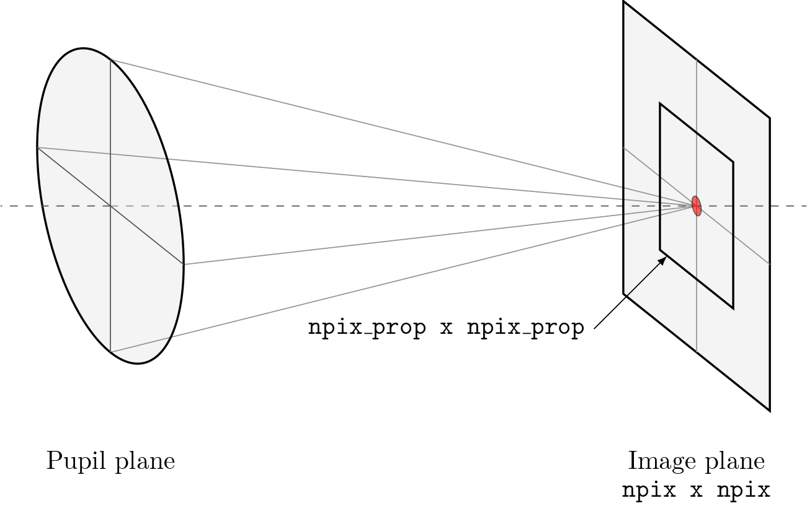

.. _user.fundamentals.diffraction:

*********************************
Numerical diffraction propagation
*********************************

Lentil uses Fourier transform-based algorithms to numerically model the propagation of an
electromagnetic field through an optical system. The electromagnetic field is represented
by a |Wavefront| object which stores the complex amplitude of the field at a discretely
sampled grid of points. The optical system is represented by a set of user-defined |Plane|
objects which the wavefront interacts with as it propagates through the system.

.. note::

    This section of the User Guide assumes an undergraduate-level understanding of
    physical and Fourier optics. In-depth mathematical background and an extensive
    discussion of the validity of each diffraction approximation is available in [1]_.

Numerical diffraction propagation
=================================
Lentil numerically models diffraction by propagating a |Wavefront| object through
any number of |Plane| objects representing an optical system. This propagation always
follows the same basic flow:

1. **Create a new wavefront** - A |Wavefront| represents a monochromatic, discretely
   sampled complex field that may propagate through space. By default, when a new
   |Wavefront| is constructed it represents an infinite plane wave (``1+0j``). Note
   that "infinite" in this case really just means that the wavefront field is
   `broadcastable <https://numpy.org/doc/stable/user/basics.broadcasting.html>`_ to
   any shape necessary.

    .. code-block:: pycon

        >>> w1 = lentil.Wavefront(wavelength=650e-9)
        >>> w1.field
        1+0j
        >>> w1.focal_length
        inf

2. **Propagate the wavefront through the first plane in the optical system** - the
   planes that describe an optical system typically modify a propagating wavefront
   in some way. By multiplying a |Wavefront| and a |Plane| together, a new
   |Wavefront| is returned representing the the complex field after propagating
   through the plane:

    .. code-block:: pycon

        >>> pupil = lentil.Pupil(amplitude=lentil.circle((256, 256), 120),
        ...                      pixelscale=1/240, focal_length=10)
        >>> w2 = w1 * pupil

    Note the complex field of ``w2`` now clearly shows the effect of propagating through the
    circular aperture of ``pupil``:

    .. code-block:: pycon

        >>> plt.imshow(np.abs(w2.field))

    .. plot::
        :context: reset
        :scale: 50

        pupil = lentil.Pupil(amplitude=lentil.circle((256, 256), 120),
                             pixelscale=1/240, focal_length=10)
        w1 = lentil.Wavefront(650e-9)
        w2 = w1 * pupil
        plt.imshow(np.abs(w2.field))

    Additionally, because ``w2`` was propagated through a |Pupil| plane, it has inherited the
    pupil's focal length:

    .. code-block:: pycon

        >>> w2.focal_length
        10

    .. note::

        Additional details on the plane-wavefront interaction can be found in
        :ref:`user.fundamentals.plane_wavefront`.

3. **Propagate the wavefront to the next plane in the optical system** - the |Wavefront|
   object provides a number of methods to propagate between planes. The appropriate method
   should be chosen based on the plane types the wavefront is propagating between.

   ======= ======= =========================================
   From    To      Method
   ======= ======= =========================================
   |Pupil| |Image| :func:`~lentil.Wavefront.propagate_image`
   |Image| |Pupil| :func:`~lentil.Wavefront.propagate_pupil`
   |Pupil| |Pupil| N/A
   |Image| |Image| N/A
   ======= ======= =========================================

   Propagations are defined by the following attributes:

   * :attr:`pixelscale` - the spatial sampling of the output plane
   * :attr:`npix` - the shape of the output plane
   * :attr:`npix_prop` - the shape of the propagation plane. See
     :ref:`user.diffraction.npix` for additional details.
   * :attr:`oversample` - the number of times to oversample the output plane.
     See the section on :ref:`user.diffraction.sampling` for more
     details.

   For example, to propagate a |Wavefront| from a |Pupil| to an |Image| plane:

    .. plot::
        :context: close-figs
        :include-source:
        :scale: 50

        >>> w2 = lentil.propagate_dft(w2, pixelscale=5e-6, shape=(64,64), oversample=5)
        >>> plt.imshow(w2.intensity, norm='log')

    .. note::

        When propagating between like planes (pupil to pupil or image to image),
        no additional propagation step is required.

4. **Repeat steps 2 and 3 until the propagation is complete** - if multiple planes
   are required to model the desired optical system, steps 2 and 3 should be
   repeated until the |Wavefront| has been propagated through all of the planes.

Broadband (multi-wavelength) propagations
-----------------------------------------
The steps outlined above propagate a single monochromatic |Wavefront| through an
optical system. The example below performs the same operation for multiple
different wavelengths and accumulates the resulting image plane intensity:

.. plot::
    :context: reset
    :scale: 50
    :include-source:

    pupil = lentil.Pupil(amplitude=lentil.circle((256, 256), 120),
                         pixelscale=1/240, focal_length=10)

    wavelengths = np.arange(450, 650, 10)*1e-9
    img = np.zeros((320,320))

    for wl in wavelengths:
        w = lentil.Wavefront(wl)
        w = w * pupil
        w = lentil.propagate_dft(w, pixelscale=5e-6, shape=(64,64), oversample=5)
        img += w.intensity

    plt.imshow(img, norm='log')

Keep in mind the output ``img`` array must be sized to accommodate the oversampled
wavefront intensity given by ``npix`` * ``oversample``.

.. note::

    Each time ``wavefront.field`` or ``wavefront.intensity`` is accessed, a new Numpy
    array of zeros with shape = ``wavefront.shape`` is allocated. It is possible to
    avoid repeatedly allocating large arrays of zeros when accumulating the result of
    a broadband propagation by using :func:`Wavefront.insert` instead. This can result
    in significant performance gains, particularly when ``wavefront.shape`` is large.

    The above example can be rewritten to use :func:`Wavefront.insert` instead:

    .. code-block:: python

        for wl in wavelengths:
            w = lentil.Wavefront(wl)
            w = w * pupil
            w = lentil.propagate_dft(w, pixelscale=5e-6, shape=(64,64), oversample=5)
            img = w.insert(img)

.. _user.diffraction.npix:

``npix`` vs ``npix_prop``
-------------------------
Lentil's propagation methods have two arguments for controlling the shape of
the propagation output: ``npix`` and ``npix_prop``.

``npix`` specifies the shape of the entire output plane while ``npix_prop``
specifies the shape of the propagation result. If ``npix_prop`` is not
specified, it defaults to ``npix``. The propagation result is placed in the
appropriate location in the (potentially larger) output plane when a |Wavefront|
:attr:`~lentil.Wavefront.field` or :attr:`~lentil.Wavefront.intensity`
attribute is accessed.

It can be advantageous to specify ``npix_prop`` < ``npix`` for performance
reasons, although care must be taken to ensure needed data is not accidentally
left out:

.. plot:: user/fundamentals/plots/npix_prop.py
    :scale: 50

For most pupil to image plane propagations, setting ``npix_prop`` to 128 or 256
pixels provides an appropriate balance of performance and propagation plane size.

For image to pupil plane propagations, ``npix_prop`` must be sized to ensure
the pupil extent is adequately captured. Because the sampling constraints on
image to pupil plane propagations are typically looser, it is safest to let
``npix_prop`` default to the same value as ``npix``.

Discrete Fourier transform algorithms
-------------------------------------
Most diffraction modeling tools use the Fast Fourier Transform (FFT) to evaluate the
discrete Fourier transform (DFT) when propagating between planes. While the FFT provides
great computational and memory efficiency, high-fidelity optical simulations may require
working with exceptionally large zero-padded arrays to satisfy the sampling requirements
imposed by the FFT.

Lentil implements a more general form of the DFT sometimes called the matrix triple
product (MTP DFT) to perform the Fourier transform to propagate between planes. While the
MTP DFT is slower than the FFT for same sized arrays, the MTP DFT provides independent
control over the input and output plane sizing and sampling. This flexibility makes the
MTP DFT ideally suited for performing propagations to discretely sampled image planes
where it is often necessary to compute a finely sampled output over a relatively small
number of pixels.

The chirp Z-transform provides additional efficiency when transforming large arrays.
Lentil selects the most appropriate DFT method automatically based on the plane size and
sampling requirements.

.. _user.diffraction.sign:

Sign of the DFT complex exponential
~~~~~~~~~~~~~~~~~~~~~~~~~~~~~~~~~~~
Lentil adopts the convention that phasors rotate in the counter-clockwise
direction, meaning their time dependence has the form :math:`\exp(-i\omega t)`.
While this is an arbitrary choice, it matches the choice made in most classic
optics texts. The implications of this choice are as follows:

* Forward propagations use :func:`lentil.fourier.dft2`, `Numpy's fft2 <https://numpy.org/doc/stable/reference/routines.fft.html#implementation-details>`_,
  or `FFTW's FFTW_FORWARD <http://fftw.org/fftw3_doc/The-1d-Discrete-Fourier-Transform-_0028DFT_0029.html>`_
* Backward propagations use :func:`lentil.fourier.idft2`, `Numpy's ifft2 <https://numpy.org/doc/stable/reference/routines.fft.html#implementation-details>`_,
  or `FFTW's FFTW_BACKWARD <http://fftw.org/fftw3_doc/The-1d-Discrete-Fourier-Transform-_0028DFT_0029.html>`_
* A converging spherical wave is represented by the expression
  :math:`\exp\left[-i\frac{k}{2z} (x^2 + y^2)\right]`
* A diverging spherical wave is represented by the expression
  :math:`\exp\left[i\frac{k}{2z} (x^2 + y^2)\right]`

.. _user.diffraction.sampling:

Sampling considerations
=======================

.. .. plot:: _img/python/dft_discrete_Q_sweep.py
..     :scale: 50

.. .. plot:: _img/python/dft_q_sweep.py
..     :scale: 50

.. .. image:: /_static/img/propagate_fourier_period.png
..     :width: 550px
..     :align: center

.. _user.diffraction.tilt:

Working with large tilts
========================
.. image:: /_static/img/propagate_tilt_phase.png
    :width: 450px
    :align: center

.. image:: /_static/img/propagate_tilt_phase_wrap.png
    :width: 650px
    :align: center

.. image:: /_static/img/propagate_tilt_angle.png
    :width: 600px
    :align: center

.. image:: /_static/img/propagate_tilt_angle_steps.png
    :width: 600px
    :align: center

.. _user.diffraction.segmented:

Differences for segmented apertures
===================================

.. [1] Goodman, *Introduction to Fourier Optics*.
