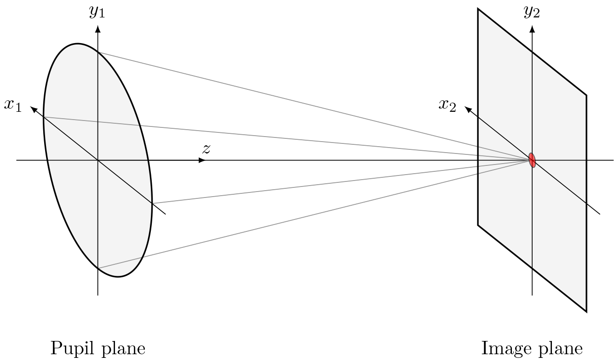

*****************
Coordinate System
*****************

.. |Pupil| replace:: :class:`~lentil.Pupil`
.. |Image| replace:: :class:`~lentil.Image`

Lentil adopts the widely used convention of aligning the z-axis along the propagation 
direction of light through an optical system. By the right hand rule, it follows that 
the remaining axes are oriented as shown in the figure below:

Lentil also adopts the right hand rule convention for rotations about the coordinate
system defined above. The following rotations are used:

* Rotations in +x rotate the yz plane counter-clockwise about the x-axis
* Rotations in +y rotate the xz plane counter-clockwise about the y-axis
* Rotations in +z rotate the xy plane counter-clockwise about the z-axis

.. warning::

  Common array plotting functions including Matplotlib's ``imshow()`` method and 
  MATLAB's ``imagesc()`` method default to placing the origin in the upper right corner
  of the displayed image. This doesn't necessarily present a problem as long as these 
  functions are consistently used "incorrectly", but to be completely correct 
  (particularly  when comparing model-generated images against intuition or measured 
  data) the origin should be located in the lower left corner of the displayed image.
