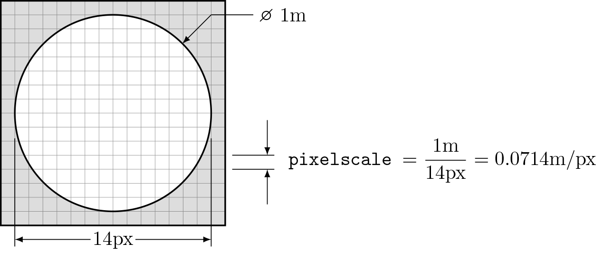
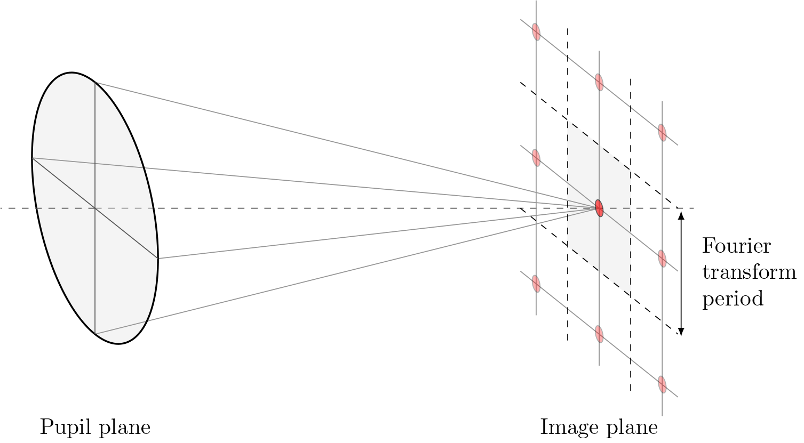
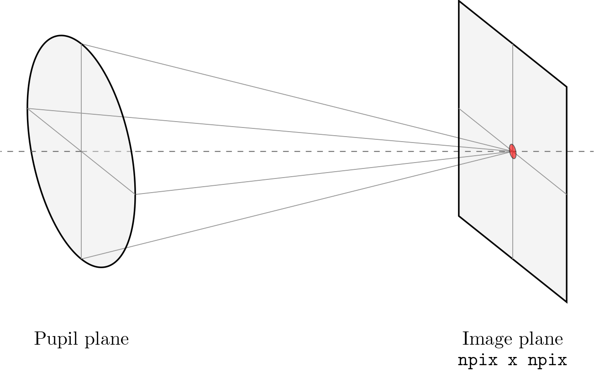
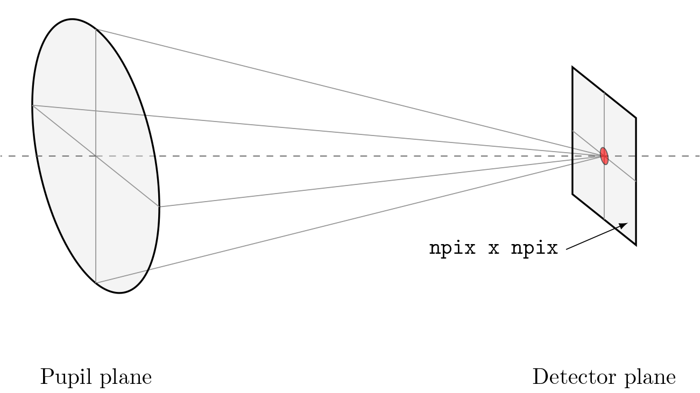
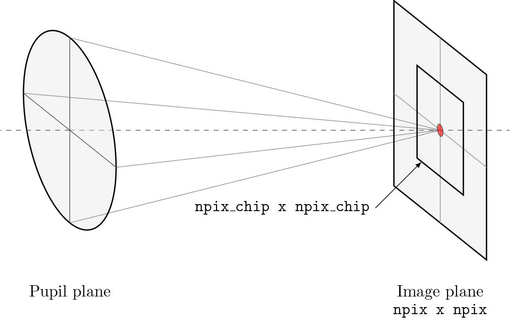
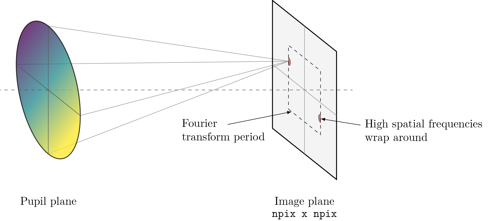
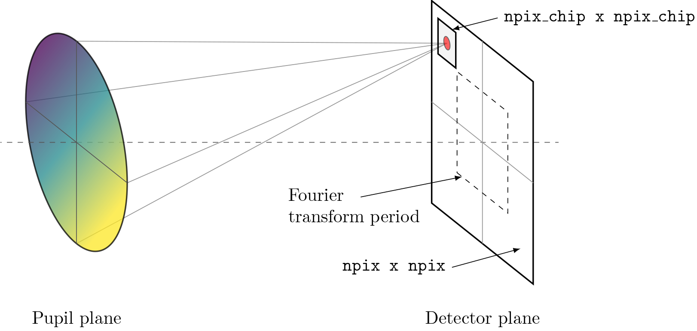
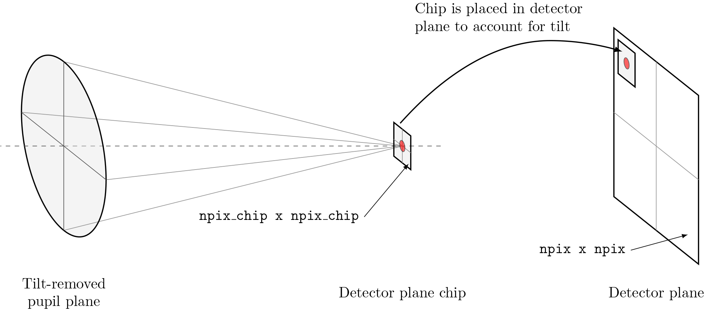

********************
Modeling Diffraction
********************

.. _diffraction-sampling:

Sampling
========

Specifying npix and npix_chip
=============================

.. _diffraction-tilt:

Working with large tilts
========================
.. image:: ../_static/img/propagate_tilt_phase.png
    :width: 450px
    :align: center

.. _diffraction-fraunhofer:

Fraunhofer Diffraction
======================

.. The vast majority of real world optical systems can be adequately modeled using the
.. far-field diffraction approximation. With this approximation, the relationship
.. between pupil and image planes is given by a two-dimensional Fourier transform.

.. Monocle uses the standard FFT approach for transforming between pupil and image
.. planes. For propagations from a pupil to discretely sampled :class:`~monocle.Detector`
.. plane, Monocle uses the more general form of the Discrete Fourier Transform (DFT).
.. While the DFT is slower than the FFT for similarly sized arrays, it provides a great
.. deal of flexibility in output plane sampling and sizing when compared with the FFT.
.. This makes the DFT ideally suited for performing propagations to discretely sampled
.. image planes where it is often desirable to compute a finely sampled image over a
.. relatively small number of pixels [2]_.

The Plane-Wavefront interaction is governed by the Plane's multiply() method. Generally
speaking, the multiply method constructs a complex phasor from a Plane or Pupil phase
and amplitude and Wavefront wavelength and multiplies the wavefront data by it. The
type and direction of the Fourier transfer used to propagate between planes depends on
the wavefront's planetype the planetype of the destination plane, and the destination
plane sampling. The table below describes the possible combinations:

+------------------------+-----------------------------+--------------------+
| Wavefront planetype    | Destination plane planetype | Propagation method |
+========================+=============================+====================+
| Pupil                  | Pupil                       | None               |
+------------------------+-----------------------------+--------------------+
| Pupil                  | Image                       | FFT                |
+------------------------+-----------------------------+--------------------+
| Pupil                  | Detector                    | DFT                |
+------------------------+-----------------------------+--------------------+
| Image                  | Pupil                       | IFFT               |
+------------------------+-----------------------------+--------------------+
| Image                  | Image                       | None               |
+------------------------+-----------------------------+--------------------+
| Image                  | Detector                    | Interpolation      |
+------------------------+-----------------------------+--------------------+
| Detector               | Any                         | Not supported      |
+------------------------+-----------------------------+--------------------+

As mentioned earlier, non-Pupil and Image planes can also be included in the
propagation planes list. This is primarily done to simplify using planes with special
Plane-Wavefront multiplication behavior (the ``Grism`` plane is a perfect example). When
"vanilla" Plane objects are inserted into the propagation list, their multiply() method
is still called and the Wavefront's complex field attribute is affected accordingly, but
none of the additional Plane-Wavefront interactions occur. The diagram below helps to
clarify this behavior

.. Draw a diagram showing both a Pupil -> Image and Pupil -> Plane -> image flow.
.. Show when complex phasor is applied to WF.data and when focal length and planetype
.. is updated. Also show propagation between steps (i.e. Pupil -> DFT -> Image vs.
.. Pupil -> None -> Plane -> DFT -> Image)

.. Using this approach, a dispersive element can be inserted between a Pupil and Image
.. or Detector plane

.. _diffraction-fresnel:

Fresnel Diffraction
===================
Lentil does not currently support modeling near-field diffraction.
