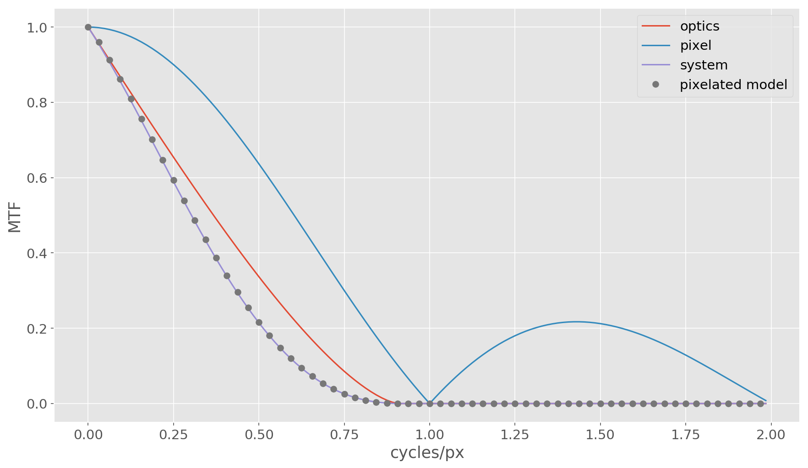

*****************
Imaging Artifacts
*****************

Jitter
======

Smear
=====

Pixel MTF
=========
A focal plane array samples a continuous light field to produce a digital image. Because
Lentil models diffraction numerically by propagating a finite set of points through an
optical system, the discretely sampled image plane intensity must be convolved with the
pixel's aperture function to accurately represent the intensity signal seen by each
pixel. Lentil's :func:`~lentil.FPA.frame` method contains a ``pixelate`` option to
perform this convolution. After convolving the image plane intensity with the pixel MTF,
the data is resampled to native detector sampling using :func:`~lentil.util.rescale`.

.. note::

    To ensure accuracy, the input data should be Nyquist sampled.

Validating Lentil's pixel MTF implementation against the analytic solution
--------------------------------------------------------------------------

The following code snippet compares the results of a numerical simulation using Lentil
with the analytic result for the same imaging system:

.. code-block:: python3

    import numpy as np
    import matplotlib.pyplot as plt
    import lentil

    # Define some system parameters
    diameter = 1
    focal_length = 5
    f_number = focal_length/diameter
    du = 5e-6
    wave = 550e-9

    cutoff_freq = 1/(f_number*wave)  # cycles/m
    cutoff_freq_mm = cutoff_freq/1e3  # cycles/mm

    # Define some simulation parameters
    npix = 256
    oversample = 4
    psf_sampling = du/oversample
    psf_sampling_mm = psf_sampling * 1e3

    # Set up the spatial frequencies we'll evaluate the MTF at
    # Note that we would like to at least cover the cutoff frequency here
    mtf_axis_mm = 1/psf_sampling_mm * np.arange(0,npix//2) / npix  # cycles/mm
    assert mtf_axis_mm[-1] >= cutoff_freq_mm

    mtf_axis_px = mtf_axis_mm * du/1e-3  # cycles/px

    # Compute the analytical optical MTF
    s = (mtf_axis_px*wave*f_number)/du
    s_valid = s[s<1]
    mtf_valid = 2/np.pi*(np.arccos(s_valid)-s_valid*np.sqrt(1-s_valid**2))
    mtf_optics = np.zeros_like(s)
    mtf_optics[0:s_valid.shape[0]] = mtf_valid

    # Compute the analytical pixel MTF
    f_px = mtf_axis_px
    f_px[0] = 1e-15  # We have to cheat a little to avoid a divide
    mtf_px = np.abs(np.sin(np.pi*f_px)/(np.pi*f_px))

    # The system MTF is just the product of the optical and pixel MTFs
    mtf_sys = mtf_optics * mtf_px

    # Now we'll build a simple Lentil model
    npix_pup_rad = npix/2
    npix_pup_diam = npix_pup_rad * 2
    dx = diameter/npix_pup_diam
    amp = lentil.util.circle((npix,npix),npix_pup_rad)
    alpha = (dx*du)/(wave*focal_length*oversample)

    # Compute the optical MTF from a Lentil-generated PSF
    psf = np.abs(lentil.fourier.dft2(amp, alpha, npix=npix)**2)
    psf = psf/np.max(psf)
    mtf_optics_lentil = np.abs(np.fft.fft2(psf))
    mtf_optics_lentil = mtf_optics_lentil/np.max(mtf_optics_lentil)
    mtf_optics_lentil = mtf_optics_lentil[0,0:mtf_optics_lentil.shape[0]//2]

    # Now apply Lentil's pixellation method and compute the system MTF
    psf_px = lentil.convolvable.pixel(psf, oversample=oversample)
    mtf_sys_lentil = np.abs(np.fft.fft2(psf_px))
    mtf_sys_lentil = mtf_sys_lentil/np.max(mtf_sys_lentil)
    mtf_sys_lentil = mtf_sys_lentil[0,0:mtf_sys_lentil.shape[0]//2]

    plt.plot(mtf_axis_px, mtf_optics, label='optics')
    plt.plot(mtf_axis_px, mtf_px, label='pixel')
    plt.plot(mtf_axis_px, mtf_sys, label='system')
    plt.plot(mtf_axis_px, mtf_sys_lentil, 'o', label='pixelated model')
    plt.xlabel('cycles/px')
    plt.ylabel('MTF')
    plt.legend(prop={'size': 12})

