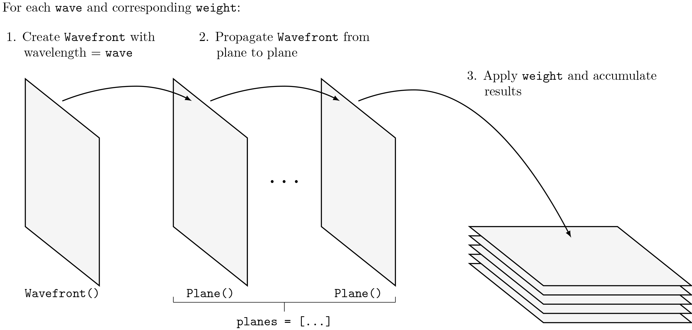

********
Overview
********

.. |Wavefront| replace:: :class:`~lentil.wavefront.Wavefront`
.. |Plane| replace:: :class:`~lentil.Plane`

Lentil currently provides algorithms for numerically modeling
:ref:`diffraction-fraunhofer` (far-field approximation). :ref:`diffraction-fresnel`
(near-field approximation) algorithms may be implemented in the future if a need arises.
Lentil's propagation algorithms generally work in the same way and have a standard
interface wherever possible.

.. note::
    This section of the User Guide assumes an undergraduate-level understanding of
    physical optics. In-depth mathematical background and an extensive discussion of
    the validity of each diffraction approximation is available in [1]_.

General propagation algorithm
=============================
Lentil models diffraction numerically by propagating a |Wavefront| object through a
series of |Plane| objects representing an optical system. The general algorithm is as
follows:

First, a new |Wavefront| object is created with the desired wavelength (note the input
wavefront is assumed to be a plane wave). Next, the |wavefront| is propagated from
|Plane| to |Plane| through the list of specified planes. The specifics of the plane to
plane propagation depend on the propagation type (Fraunhofer vs. Fresnel) and additional
plane attributes specific to each propagation. The results are accumulated, and any
provided weight is applied. This process is repeated for each requested wavelength.
Finally, some general post-processing may be applied depending on the supplied
propagation parameters.

General propagation interface
=============================
The general propagation interface is provided by the :func:`~lentil.propagate`  method.
The following attributes govern the propagation:

* :attr:`planes` - a list of |Plane| objects representing an optical system
* :attr:`wave` - the wavelength used for the propagation. If a list of wavelengths is
  provided, the propagation will be performed for each value and the ressult will
  represent a polychromatic propagation.
* :attr:`weight` - the weight associated with each wavelength in :attr:`wave`. Note that
  weights can be either relative or absolute depending on the use case.

Additional options provide further customization of the propagation behavior:

* :attr:`npix`
* :attr:`npix_chip`
* :attr:`oversample`
* :attr:`rebin`
* :attr:`tilt` - specifies the tilt handling strategy. See :ref:`diffraction-tilt` for
  more details.
* :attr:`interp_phasor` See :ref:`diffraction-sampling` for more details.
* :attr:`flatten` - specifies whether to collapse wavelength-specific output planes to a
  single array or return a 3D cube of results

.. [1] Goodman, *Introduction to Fourier Optics*.

