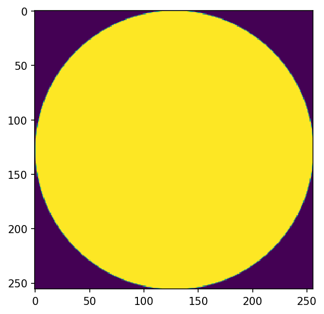
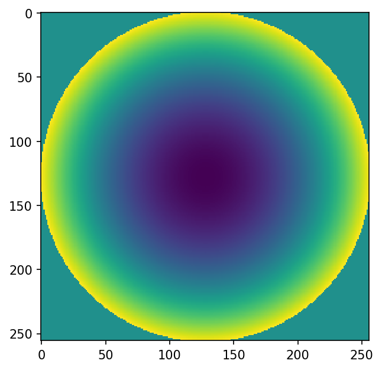
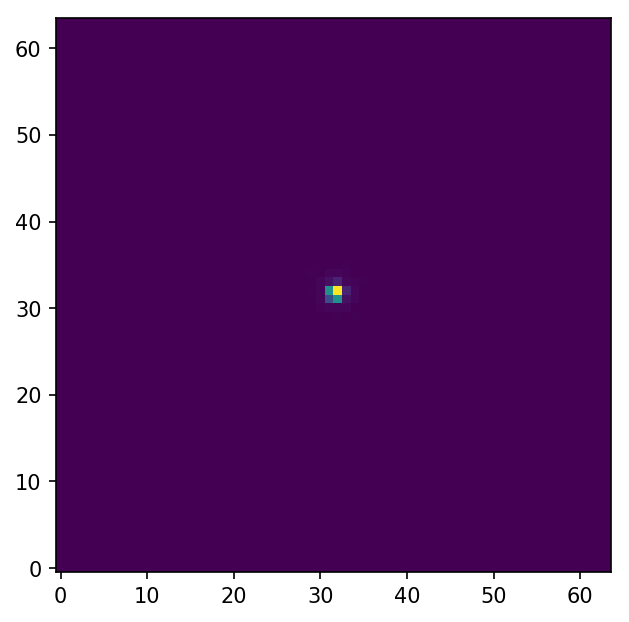
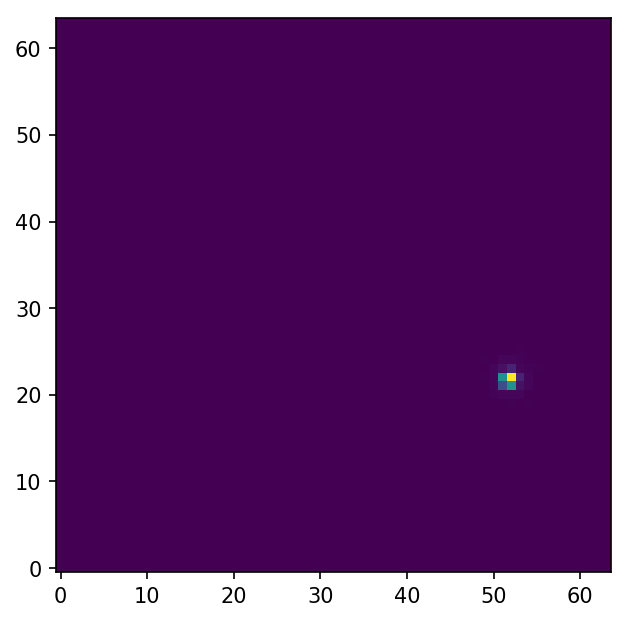
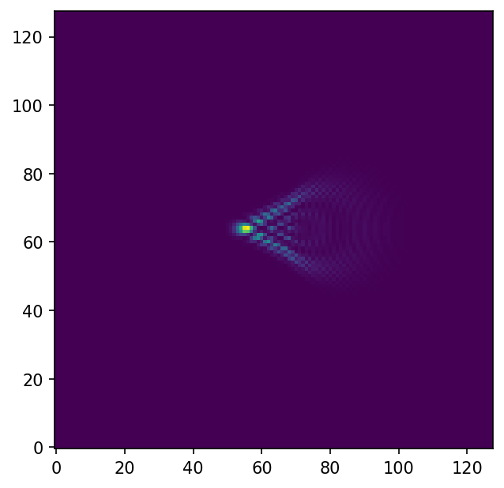

**************
Optical Planes
**************

Planes
======
Lentil's :class:`~lentil.Plane` object represents a discretely sampled plane in an
optical model. Planes typically have some influence on the propagation of a
wavefront through a model. Planes have the following attributes that interact with a
wavefront:

* :attr:`~lentil.Plane.amplitude` - Defines the relative Wavefront transmission
  (spatially) through the Plane
* :attr:`~lentil.Plane.phase` - Defines the phase shift that a wavefront experiences
  when propagating through the Plane
* :attr:`~lentil.Plane.mask` - Defines the binary mask over which the Plane data is
  valid
* :attr:`~lentil.Plane.segmask` - Defines the set of masks over which any segments in
  the Plane are valid. If None, no segments are defined.
* :attr:`~lentil.Plane.pixelscale` - Defines the physical sampling of each pixel in
  the above attributes

.. note::

    All Plane attributes have sensible default values that have no effect on
    propagations when not defined.

.. _creating-planes:

Creating Planes
---------------

Command line
^^^^^^^^^^^^

Simple Planes are easy to define from the command line:

.. code-block:: pycon

    >>> import lentil
    >>> import matplotlib.pyplot as plt
    >>> aperture = lentil.Plane(amplitude=lentil.util.circle((256,256), 128))
    >>> plt.imshow(aperture.amplitude)

Once a Plane is defined, its attributes can be modified at any time:

.. code-block:: pycon

    >>> aperture.phase = 2e-6 * lentil.zernike.zernike(aperture.mask, 4)
    >>> plt.imshow(aperture.phase)

In a module
^^^^^^^^^^^
Depending on their use, sometimes it will be more convenient to define Planes in a
module. In this case, you should subclass ``Plane``:

.. code-block:: python3

    import lentil

    class CustomPlane(le.Plane):
        def __init__(self):
            self.amplitude = lentil.util.circle((256,256), 128)
            self.opd = 2e-6 * lentil.zernike.zernike(lentil.util.circlemask((256,256),128), 4)

Any of Plane's attributes can also be redefined as properties if further customization
is needed. This is typically necessary if an attribute is stateful or has some sort of
randomness:

.. code-block:: python3

    import lentil

    class CustomPlane(lentil.Plane):
        def __init__(self, focus = 0):
            self.mask = lentil.util.circlemask((256,256), 128)
            self.amplitude = lentil.util.circle((256,256), 128)
            self.focus = focus

        @property
        def phase(self):
            focus_opd = self.focus * lentil.zernike.zernike(self.mask)
            random_opd = lentil.zernike.zernike_compose(self.mask, 1e-6*np.random.random(10))
            return focus_opd + random_opd

.. note::

    While the computation that occurs when accessing the ``phase`` attribute in the
    example above isn't particularly expensive, it will be unnecessarily repeated many
    times during a single propagation (once for each wavelength).

    Using Lentil's :class:`~lentil.modeltools.cached_property` decorator instead of
    Python's ``property`` decorator enables these attributes' return values to be
    cached, offering a substantial increase in propagation performance.

    When a function decorated with ``cached_property`` is called, if a cached value for
    that attribute exists it is returned, otherwise the function is executed and the
    resulting computed value is returned.

    For more details, see :ref:`caching`.

Pupils
======

.. |Pupil| replace:: :class:`~lentil.Pupil`
.. |Image| replace:: :class:`~lentil.Image`
.. |Plane| replace:: :class:`~lentil.Plane`

Lentil's |Pupil| plane provides a convenient way to represent a generalized pupil
function. |Pupil| planes, along with |Image| planes provide the foundation for modeling
diffraction using the far-field approximation. |Pupil| planes behave exactly like
|Plane| objects but introduce an implied spherical phase term defined by the
:attr:`~lentil.Pupil.focal_length` attribute where :math:`r = 2f`. Detailed discussion
of pupil planes is available in [1]_.

Creating Pupils
---------------
Like |Plane| objects, |Pupil| objects can be created from the command line or by
subclassing |Pupil|. See :ref:`creating-planes` for details.

.. [1] Goodman, *Introduction to Fourier Optics*.

Image Planes
============

Tilt
====
The :class:`~lentil.Tilt` plane provides a mechanism for directly specifying wavefront
tilt outside of the context of a discretely sampled :class:`~lentil.Plane` object.
:class:`~lentil.Tilt` is most useful for representing global tilt of an optical system
during a propagation.

For example, given the following :class:`~lentil.Pupil` and :class:`~lentil.Image`
planes:

.. code-block:: pycon

    >>> import lentil
    >>> import matplotlib.pyplot as plt
    >>> pupil = lentil.Pupil(amplitude=lentil.util.circle((256, 256), 128), diameter=1,
    ...                      focal_length=10, pixelscale=1/256)
    >>> detector = lentil.Image(pixelscale=5e-6, shape=(1024, 1024))
    >>> psf = lentil.propagate([pupil, detector], wave=650e-9, npix=(64, 64))
    >>> plt.imshow(psf, origin='lower')

it is simple to see the effect of introducing a tilted wavefront into the system:

.. code-block:: pycon

    >>> tilt = lentil.Tilt(x=10e-6, y=-5e-6)
    >>> psf = lentil.propagate([tilt, pupil, detector], wave=650e-9, npix=(64, 64))
    >>> plt.imshow(psf, origin='lower')

Plane Transformations
=====================
The plane transformation examples below are used to modify the following image:

.. code-block:: pycon

    >>> import lentil
    >>> import matplotlib.pyplot as plt
    >>> pupil = lentil.Pupil(amplitude=lentil.util.circle((256, 256), 128), diameter=1,
    ...                      focal_length=10, pixelscale=1/256)
    >>> detector = lentil.Image(pixelscale=5e-6, shape=(1024, 1024))
    >>> psf = lentil.propagate([pupil, detector], wave=650e-9, npix=(128, 128))
    >>> plt.imshow(psf, origin='lower')

Rotate
------
:class:`~lentil.Rotate` can be used to rotate a Wavefront by an arbitrary amount:

.. code-block:: pycon

    >>> rotation = lentil.Rotate(angle=30, unit='degrees')
    >>> psf = lentil.propagate([pupil, rotation, detector], wave=650e-9, npix=(128, 128))
    >>> plt.imshow(psf, origin='lower')

Flip
----
:class:`~lentil.Flip` can be used to flip a Wavefront about its axes:

.. code-block:: pycon

    >>> flip = lentil.Flip(axis=1)
    >>> psf = lentil.propagate([pupil, flip, detector], wave=650e-9, npix=(128, 128))
    >>> plt.imshow(psf, origin='lower')

.. Active Optics and Deformable Mirrors
.. ====================================

.. Dispersion and Chromatic Aberration
.. ===================================

.. Lenslet Arrays
.. ==============

